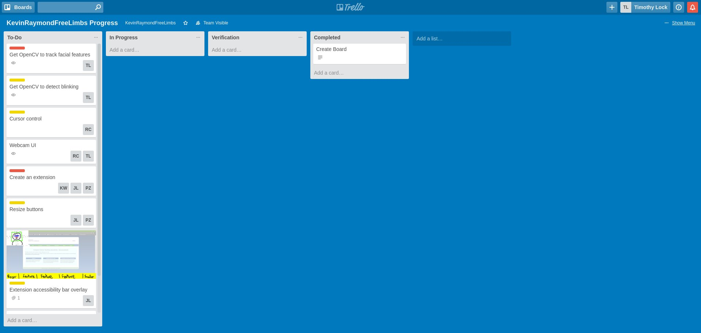

# LimbsFreeTeam/Team 4

 > _Note:_ This document is meant to be written during (or shortly after) your initial planning meeting.     
 > It does not really make sense for you to edit this document much (if at all) while working on the project - Instead, at the end of the planning phase, you can refer back to this document and decide which parts of your plan you are happy with and which parts you would like to change.

## Iteration XX

 * Start date: February 1st, 2017
 * End date: February 6th, 2017

## Process

(Optional:) Quick introduction

#### Roles & responsibilities

Describe the different roles on the team and the responsibilities associated with each role.
-*Front-end Developer (extension)*: Develop the UI that the user will see on the page

-*Back-end Developer (extension)*: Develop the backend that handles manipulation of page, etc.

-*Front-end Developer (face tracking)*: Develop the UI of the face tracking software

-*Back-end Developer (face tracking)*: Develop the computer vision algorithms, mouse movement, etc.

-*Testing and Verification:* Conduct unit / black box testing to make sure it works

#### Events

Online Meeting: This meeting will be held twice a week on Wednesday and Friday night. This will be a short meeting to track all teammates’ progress.

Weekly In-person Meeting: This meeting will be held on every Monday at 5pm(before class). The purpose of this meeting is to discuss about the progress and assign work. 

Code Review and Testing Session: This will be held 3 days before each phase’s due date. The purpose of this session is to make sure the deliverable is working as planned and free of error.

Bi Weekly Planning Meeting: This meeting will be held after In-person meeting. New features  and short-term goals will be set during this meeting.

#### Artifacts

-To-do list in a kanban/scrum fashion. Hosted on Trello.

-Priority are determined in our planning meetings and labelled using labels in our Trello

-Since each member knows their role, they are assigned to each card on Trello that matches their role

-Scheduling is determined in our planning meetings and assigned on the card in Trello so that it is easy to view due dates. 

-Code to be managed on Github

-Communication is handled via Slack

## Product

#### Goals and tasks

-Get OpenCV to track facial features
-Create an Chrome extension
-Setup Trello and assign the To-Do list
-Familiarize with the working environment 
-Learn about Chrome extension development 

#### Artifacts
Images to support statements

Text for detailed explanation 
Supporting research

http://www.cerebralpalsy.org/about-cerebral-palsy/definition

https://mssociety.ca/about-ms/what-is-ms

https://www.ninds.nih.gov/Disorders/Patient-Caregiver-Education/Fact-Sheets/Amyotrophic-Lateral-Sclerosis-ALS-Fact-Sheet

https://www.slashgear.com/griffin-unveils-mouthstick-stylus-for-the-disabled-01272015/

http://www.orin.com/access/sip_puff/

https://www.brainasoft.com/braina/

https://www.researchgate.net/publication/237091257_Assisting_people_with_disabilities_through_Kinect_sensors_into_a_smart_house?enrichId=rgreq-41e322896526ad3126ec0b0bfbb4aa4f-XXX&enrichSource=Y292ZXJQYWdlOzIzNzA5MTI1NztBUzoxMDI1OTkzNDQ3ODc0NTZAMTQwMTQ3Mjk5ODE5Mw%3D%3D&el=1_x_2&_esc=publicationCoverPdf 

http://gettecla.com/blogs/news/13884757-4-ways-quadriplegics-can-use-an-ipad-or-iphone

http://www.brainandspinalcord.org/quadriplegia/

