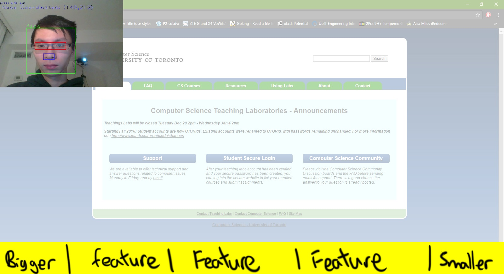
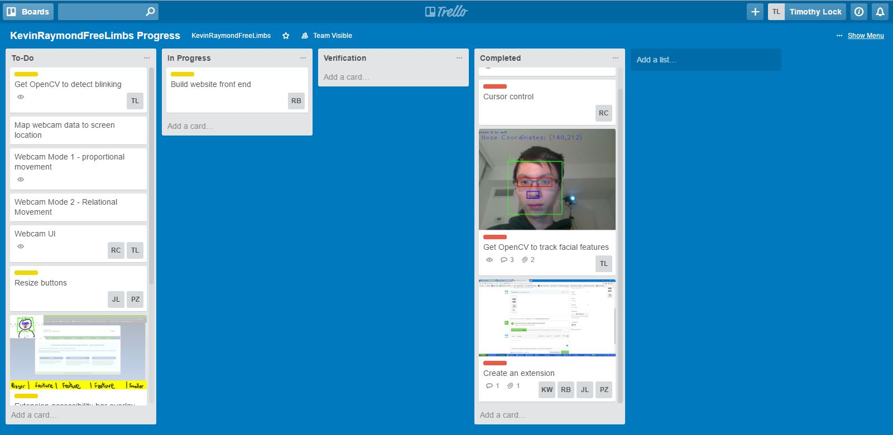

# LimbsFreeTeam/Team 4

## Iteration 01 - Review & Retrospect

 * When: Thursday, February 9th 2017
 * Where: Bahen Centre

## Process - Reflection

The software allows the user to control the computer cursor using the webcam. The software will also make web pages more accessible so that the cursor can click on items more easily. Intended to bridge the gap between amputees with missing limbs (including arms), the software uses computer vision to move the cursor around the screen. We also plan to make  a chrome extension that overlays controls onto the screen that when clicked, can introduce new on-screen inputs / make the page more accessible. Using only the webcam and mic, this software aims to be extremely portable with the only requirements of having a computer/laptop with a webcam (mic optional). 

#### Decisions that turned out well
 
-Using python for the cursor control because 1) compatible with OpenCV 2) compatible with group member skillsets  
-Never made extension but it is a project which we feel is appropriate given our skillset  
-Using Trello and Slack for project management. Our project management is going well.  

#### Decisions that did not turn out as well as we hoped

-Project is too simple in scope for 6 people; the amount of work we put in for iteration 1 was not enough   
-Originally used nose tracking, then had to switch to eyes due to inaccuracies; then had to switch yet again to face tracking due to further inaccuracies   
-Trying to embed OpenCV in a Chrome extension: hard to control the mouse with a Chrome extension - just making script downloadable   

#### Planned changes

-Adding a website where users can view a demo and download the project   
-Need to figure out method to click; each choice has a tradeoff/dilemma   

## Product - Review

#### Goals and/or tasks that were met/completed:
 
All of the tasks described in the plan have been completed if not surpassed. Attached in this folder is a screenshot of the Trello in the state of iteration 1 completion along with a JSON export of the Trello board. 

#### Goals and/or tasks that were planned but not met/completed:

None - we all met our tasks. However, at the last minute we decided to add the website. Due to the decision being taken just before the due date, the group member in charge of that (Rohan) did not commit any code for that part.  

## Meeting Highlights

As stated earlier, our project scope is too limited. We are thus going to build a website where users can download the software and extension from. This will give our project a more professional feel.  
Extension needs work. It is currently in a very basic state and is missing a lot of our core requirements for the application.   
Need to come up with method for clicking. Timothy will look into ways to track clicks using facial features. Current idea is to use left/right double-blink to similate a cick.  
Everyone is on the same page, and we are working together very well. Our task management (via Trello) is running smoothly, and we have all made good progress on the work we were individually assigned (all targets were met for this iteration)   
