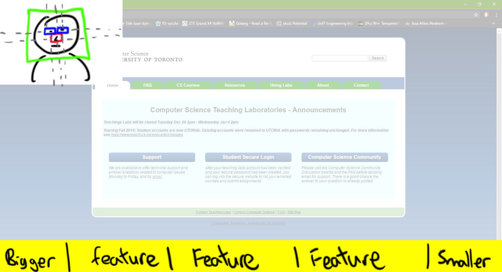

# LimbsFreeTeam/Team 4

 > _Note:_ This document is meant to evolve throughout the planning phase of your project.    
 > That is, it makes sense for you commit regularly to this file while working on the project (especially edits/additions/deletions to the _Highlights_ section).

#### Q1: What are you planning to build?

The software allows the user to control the computer cursor using the webcam. The software will also make web pages more accessible so that the cursor can click on items more easily. Intended to bridge the gap between amputees with missing limbs (including arms), the software uses computer vision to move the cursor around the screen. We also plan to make  a chrome extension that overlays controls onto the screen that when clicked, can introduce new on-screen inputs / make the page more accessible. Using only the webcam and mic, this software aims to be extremely portable with the only requirements of having a computer/laptop with a webcam (mic optional). 

#### Q2: Who are your target users?

Our target users are mainly quadriplegics. Quadriplegics are individuals who have all four of their limbs paralyzed. Hence, they as they do not have a way to control traditional input devices for computers. Individuals with brain damage that affects their motor control such cerebral palsy, amyotrophic lateral sclerosis, or similar conditions can also use Limbs Free Cursor. As control of the computer may be very inaccurate when using their limbs. Limbs Free Cursor can also be used by those who have an amputated arm to enhance their quality of life. Instead of having to switch back and forth between the mouse and keyboard, such an individual can keep their hand on the keyboard.

#### Q3: Why would your users choose your product? What are they using today to solve their problem/need?

Limbs Free Cursor distances itself from all commercially available software and hardware designed for individuals who suffer from the loss of their limbs. Unlike voice control which in often unreliable in noisy environments and for those with speech impairment, Limbs Free Cursor can be used in any location. Limbs Free Cursor is also free to use, no special hardware is required unlike a mouth stylus. A mouth stylus may provide very accurate input, but there is a cost associated with it and holding a object in the mouth for an extended period of time induces discomfort. Limbs Free Cursor also provides a very intuitive way to control the cursor, looking at where you want to click is very natural. On the other hand, Sip-and-puff is very unnatural and is just awkward at best, inhaling and exhaling into a tube is very tiring and not to mention the hygiene issues.

----

### Highlights

In the first meeting, we discussed the general direction of the product. In the second meeting, we discussed the details of the product. 

In our first group meeting, our key decisions were to decide the problem we wanted to solve, and a general direction as to how we are solving it. We had three ideas in mind: a web app designed to connect landlords and renters, an Android app that allows people to type in Braille to their computers through their phone, and a software that helps people without arms to control their cursor. The first idea was disregarded for being too simple and going against the TA’s suggestions of not using a shared economy app.  There is already an existing app that resembles our second for Braille typing. We felt like it would be too difficult improve on the existing app, or have significant deviation from it to make an unique app. After deciding the problem we want to tackle, we discussed the ways we could solve it. Existing products include a Sip and Puff implementation and Apple’s assistance mode that highlights all buttons on the iphone screen in order. However, the Sip and Puff solution is unreliable and Apple’s solution only works on specific products. We decided that we wanted to control the cursor using a webcam to track a facial feature. Since everyone in the group has experience with working on web apps, we also decided to make a Chrome extension that helps users browse the web while using our software.

In our second group meeting we discussed the details of our software. The two key decisions are:

How to control the cursor

How to click on an object

We decided that the nose is most likely the easiest facial feature to track. We had two ideas on how to control the cursor. The first was to move the cursor the direction the nose is facing and the second was to track the location of the nose and move the cursor to a relative location on the screen. We decided that the first implementation is more user friendly.

Clicking on an object is difficult since users would not have precise control of the cursor. To resolve this problem, we decided that our extension will generate two buttons on the bottom corners of the screen. We chose the bottom corners because it is easy to move the cursor to the corners. Originally, our design was that one button, when clicked, would enlarge all buttons on the browser. However, websites with a lot of buttons would be unusable. Instead, one corner button would zoom in on the webpage, and the other would zoom out. As for the action of clicking the button, we decided that nodding is probably the easiest action to perform and register.

Specify 3 - 5 key decisions and/or insights that came up during your meetings
and/or collaborative process.

